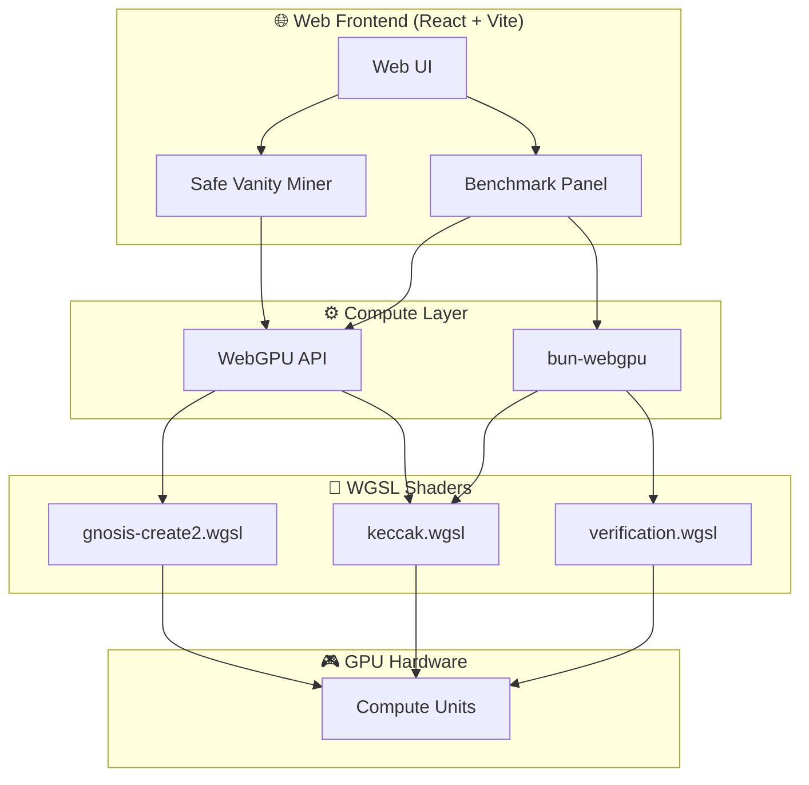
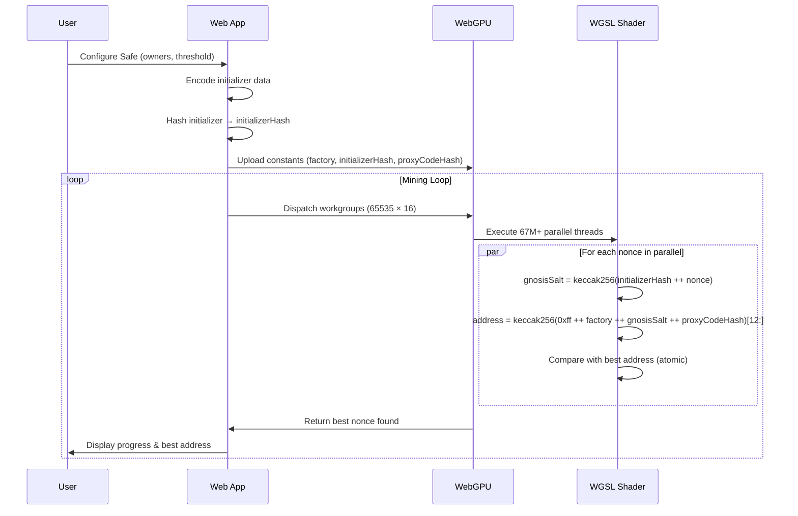
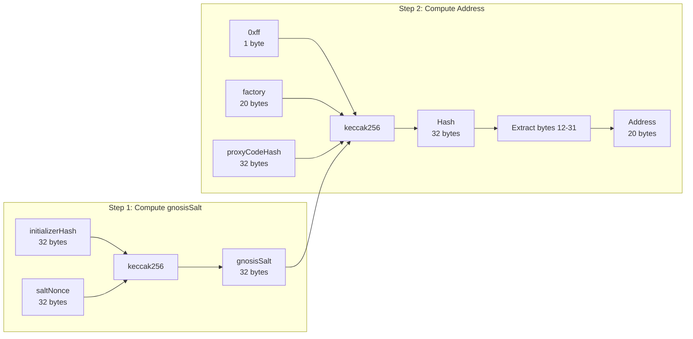
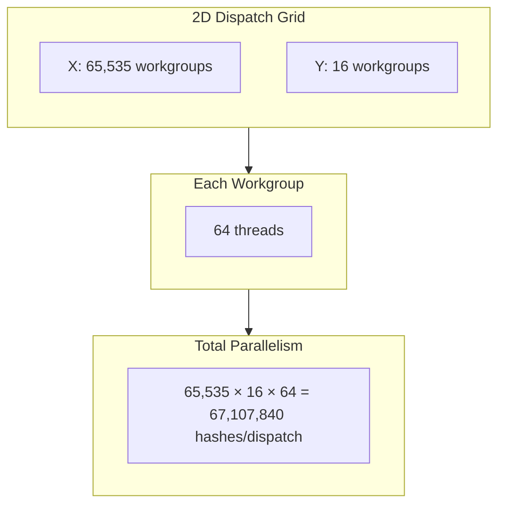
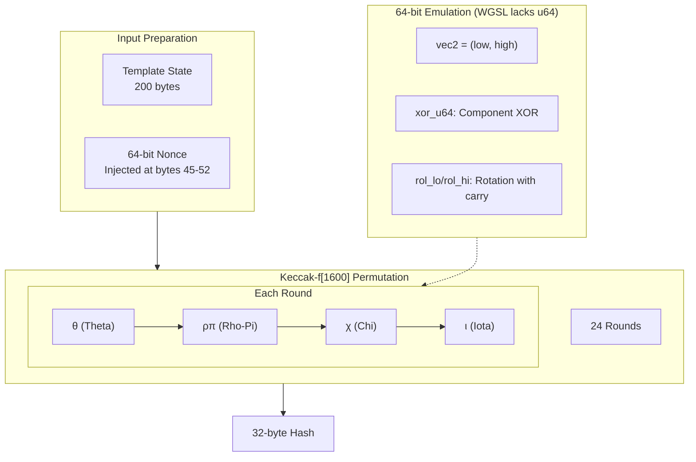
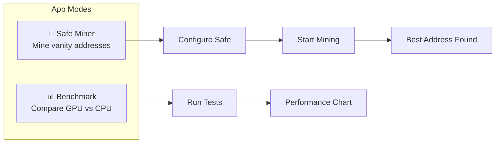
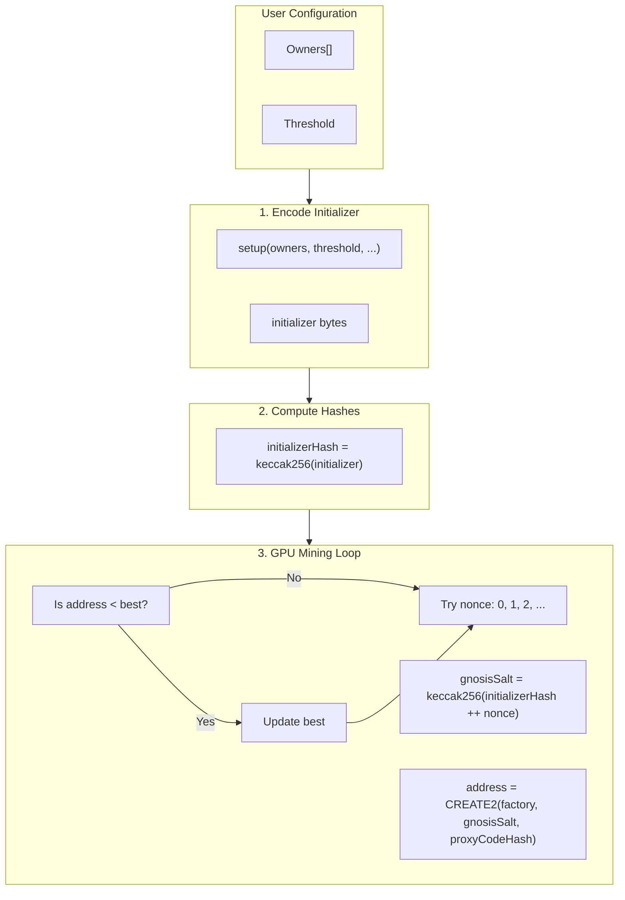

# WebGPU Create2 Cruncher

A high-performance Ethereum **CREATE2** address mining tool using **WebGPU**. Ported from the OpenCL kernel of `create2crunch` to WGSL.

## 🎯 What It Does

This tool helps you find **vanity Ethereum addresses** by mining CREATE2 salt values. CREATE2 is an Ethereum opcode that allows deterministic contract address generation based on:

- **Deployer address** (factory contract)
- **Salt** (32-byte value)
- **Init code hash** (hash of contract bytecode)

```
address = keccak256(0xff ++ deployer ++ salt ++ initCodeHash)[12:]
```

### Key Features

| Feature | Description |
|---------|-------------|
| 🖥️ **Safe Vanity Miner** | Mine vanity addresses for Gnosis Safe contracts |
| 📊 **Benchmark Mode** | Compare WebGPU vs CPU (ethers.js, viem) performance |
| 🌐 **Cross-Platform** | Runs in browsers (Chrome, Edge) and CLI (Bun) |
| ⚡ **GPU Accelerated** | Uses WebGPU Compute Shaders for massive parallelism |
| 🔬 **Verified** | Tested against real mainnet deployments (Uniswap, OpenSea) |

---

## 🏗️ Architecture

### High-Level System Overview



### Create2 Address Derivation Flow



### Gnosis Safe Address Derivation (Two-Step Keccak)



### GPU Dispatch Architecture



### Keccak-256 Implementation Details



---

## 🚀 Getting Started

### Prerequisites

- [Bun](https://bun.sh) for CLI tools and package management
- A WebGPU-compatible system:
  - **GPU**: Vulkan, Metal, or DirectX12 support
  - **Browser**: Chrome 113+, Edge 113+, or Firefox Nightly

### Installation

```bash
bun install
```

---

## 📖 Usage

### 1. Web Application (Safe Vanity Miner)

Start the development server:

```bash
bun dev
```

Visit `http://localhost:5173` in your browser.

**Features:**
- **Safe Miner Mode**: Configure Gnosis Safe parameters (owners, threshold) and mine vanity addresses
- **Benchmark Mode**: Compare GPU vs CPU hashing performance



### 2. CLI Benchmark

Run pure Keccak-256 throughput benchmark:

```bash
# Run for 5 seconds (default)
bun run benchmark

# Run for custom duration
bun run benchmark --sec 10

# Run until specific hash count
bun run benchmark --hash 100000000
```

**Example Output:**
```
🚀 Initializing WebGPU Keccak256 Benchmark...
⏱️  Target: 5 seconds
💻 Using GPU: Apple M1 Pro
Running... 5000ms | 1234.56 MHashes

📊 Results:
   Duration: 5.0012s
   Total Hashes: 1,234,567,890
   Hashrate: 246.87 MH/s
```

### 3. Tests

Validate the Keccak-256 implementation against known Ethereum mainnet CREATE2 deployments:

```bash
bun run test
```

**Test Cases Include:**
- Uniswap Permit2
- OpenSea Seaport
- Uniswap v4 PoolManager

```bash
# Test Safe address derivation specifically
bun run test:derivation
```

---

## 📁 Project Structure

```
.
├── 🌐 Web Application
│   ├── index.html              # Entry point
│   ├── src/
│   │   ├── App.tsx             # Main React app (mode switcher)
│   │   ├── components/
│   │   │   ├── SafeMinerPanel.tsx   # Vanity miner UI
│   │   │   ├── BenchmarkPanel.tsx   # Benchmark UI
│   │   │   └── HashRateChart.tsx    # D3 chart
│   │   ├── hooks/
│   │   │   ├── useSafeMiner.ts      # Mining logic
│   │   │   └── useWebGPUBenchmark.ts
│   │   └── lib/
│   │       ├── safe-encoder.ts      # Safe config encoding
│   │       └── gnosis-constants.ts  # Factory addresses
│
├── ⚙️ WGSL Shaders
│   ├── gnosis-create2.wgsl     # Gnosis Safe address mining
│   ├── keccak.wgsl             # Generic Keccak-256 benchmark
│   └── verification.wgsl       # Test verification shader
│
├── 🔧 CLI Tools
│   ├── benchmark.ts            # CLI benchmark runner
│   └── test.ts                 # Test suite
│
└── 📋 Configuration
    ├── package.json
    ├── vite.config.ts
    ├── tailwind.config.js
    └── tsconfig.json
```

---

## ⚡ Performance

### GPU vs CPU Comparison

| Implementation | Typical Hashrate | Relative Speed |
|---------------|------------------|----------------|
| **WebGPU (GPU)** | 100-500 MH/s | 🚀 1,000,000x |
| ethers.js (CPU) | 50-200 H/s | 1x |
| viem (CPU) | 50-200 H/s | 1x |

*Performance varies by hardware. Apple M-series and modern NVIDIA/AMD GPUs achieve the highest rates.*

### Optimization Techniques

1. **2D Dispatch**: 65,535 × 16 workgroups maximize GPU occupancy
2. **64-bit Emulation**: Custom `vec2<u32>` operations for Keccak rotations
3. **Atomic Operations**: Lock-free best-address tracking
4. **Pre-computed State**: Template with factory and initCodeHash pre-loaded

---

## 🔒 How Gnosis Safe Mining Works



The miner finds the **numerically smallest** address by incrementing the salt nonce. Lower addresses (more leading zeros) are generally considered more desirable "vanity" addresses.

---

## 🧪 Validation

The keccak-256 WGSL implementation is verified against real Ethereum mainnet deployments:

| Protocol | Contract | Status |
|----------|----------|--------|
| Uniswap | Permit2 | ✅ Verified |
| OpenSea | Seaport | ✅ Verified |
| Uniswap | v4 PoolManager | ✅ Verified |
| Namefi | Namefi NFT | ✅ Verified |
