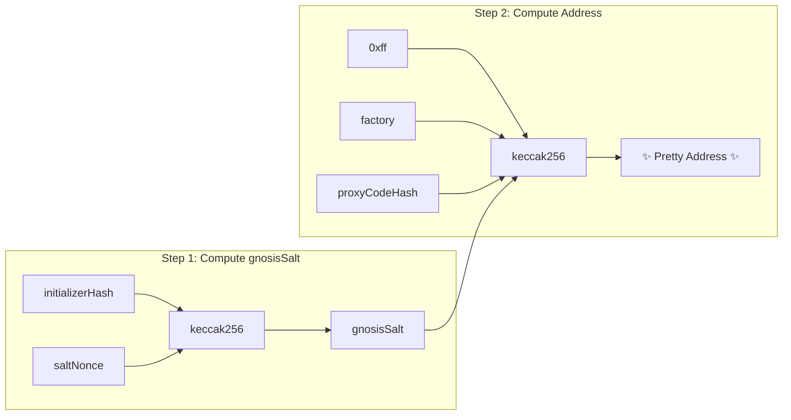
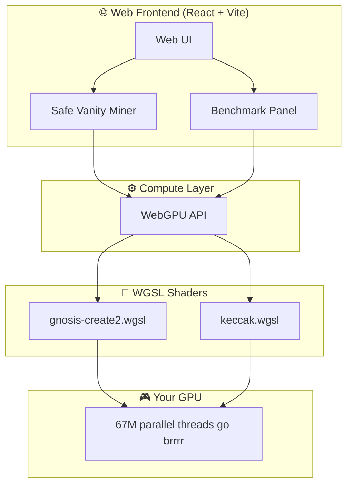

# 🪷 PrettySafe

> *Making your Safe addresses pretty since 2024. Because life's too short for ugly wallet addresses.*

The world's first **browser-native WebGPU vanity address miner** for [Safe](https://safe.global) (formerly Gnosis Safe). Mine locally with native GPU performance—**Open Source**, **No Installs**, and **100% Client-Side**.

No CUDA required. No NVIDIA 5090 needed. Works on every browser, from MacBooks to iPhones. ☕

## ✨ Why PrettySafe?

Ever looked at your Safe address and thought *"0x7a3b... meh"*?

We got you. PrettySafe lets you mine for that perfect vanity address with **leading zeros**, **repeating patterns**, or whatever makes your inner crypto-degen smile.

| Feature | Description |
|---------|-------------|
| 🧠 **WebGPU Powered** | Harnesses your GPU for blazing fast address mining |
| 🌐 **100% Browser-Based** | No downloads, no installs, no sketchy binaries |
| 🔒 **Privacy First** | Everything runs client-side. Your keys never leave your browser |
| 🍎 **Cross-Platform** | Works on Chrome, Edge, Safari, and even mobile browsers |
| ⚡ **Ridiculously Fast** | 100-500 MH/s on modern GPUs. That's like... a lot |

---

## 🚀 Quick Start

```bash
# Clone the repo
git clone https://github.com/xinbenlv/prettysafe.git
cd prettysafe

# Install dependencies
bun install

# Fire it up
bun dev
```

Then open `http://localhost:5173` and start mining your pretty address! 🎉

---

## 🎯 What Does It Actually Do?

PrettySafe mines **CREATE2 salt values** to find vanity addresses for your Safe. Here's the nerdy explanation:

```
address = keccak256(0xff ++ deployer ++ salt ++ initCodeHash)[12:]
```

We brute-force the `salt` value at GPU speeds until we find an address that's *chef's kiss* 👨‍🍳

### The Two-Step Gnosis Dance



---

## 📊 Performance

| Implementation | Hashrate | Vibe |
|---------------|----------|------|
| **WebGPU (GPU)** | 100-500 MH/s | 🚀 *zoom zoom* |
| ethers.js (CPU) | 50-200 H/s | 🐌 *still loading...* |
| viem (CPU) | 50-200 H/s | 🐢 *we'll get there eventually* |

*That's roughly **1,000,000x faster** on GPU. Not a typo.*

---

## 🏗️ Architecture

For the curious minds who want to peek under the hood:



### GPU Dispatch Architecture

We dispatch **65,535 × 16 workgroups × 64 threads = 67,107,840 parallel hashes** per dispatch.

Your GPU was born for this. 🎮

---

## 🧪 Validation

Our Keccak-256 implementation is battle-tested against real Ethereum mainnet deployments:

| Protocol | Contract | Status |
|----------|----------|--------|
| Uniswap | Permit2 | ✅ Verified |
| OpenSea | Seaport | ✅ Verified |
| Uniswap | v4 PoolManager | ✅ Verified |
| Gnosis Safe | Proxy Factory | ✅ Verified |

---

## 📁 Project Structure

```
prettysafe/
├── 🌐 src/                    # React frontend
│   ├── App.tsx                # Main app
│   ├── components/            # UI components
│   ├── hooks/                 # React hooks
│   └── lib/                   # Utilities
├── ⚙️ Shaders
│   ├── gnosis-create2.wgsl    # Safe address mining
│   └── keccak.wgsl            # Keccak-256 implementation
├── 🔧 CLI Tools
│   ├── benchmark.ts           # Performance testing
│   └── test.ts                # Validation suite
└── 📋 Config files
```

---

## 🛠️ CLI Tools

### Benchmark

```bash
bun run benchmark           # Run for 5 seconds
bun run benchmark --sec 10  # Run for 10 seconds
```

### Tests

```bash
bun run test                # Run all tests
bun run test:derivation     # Test Safe address derivation
```

---

## 🤝 Contributing

PRs welcome! Whether you're fixing bugs, adding features, or improving docs—we appreciate all contributions.

Found a bug? [Open an issue](https://github.com/xinbenlv/prettysafe/issues).

---

## 📄 License

MIT License. Do whatever you want, just don't blame us if your addresses are *too* pretty.

---

## 🙏 Credits

- Ported from [`create2crunch`](https://github.com/0age/create2crunch) by 0age
- Built with 💚 by [Zainan Victor Zhou](https://zzn.im)
- Powered by WebGPU, React, Vite, and an unhealthy amount of caffeine ☕

---

<p align="center">
  <i>May your addresses be pretty and your gas fees be low.</i> 🪷
</p>
